Seminar 5 
========================================================


```r
library(lattice)
```


```r
prDat <- read.table("C:/Users/Kateryna/Documents/RStudio/GSE4051_data.tsv")
str(prDat, max.level = 0)
```

```
## 'data.frame':	29949 obs. of  39 variables:
```

```r
prDes <- readRDS("C:/Users/Kateryna/Documents/RStudio/GSE4051_design.rds")
str(prDes)
```

```
## 'data.frame':	39 obs. of  4 variables:
##  $ sidChar : chr  "Sample_20" "Sample_21" "Sample_22" "Sample_23" ...
##  $ sidNum  : num  20 21 22 23 16 17 6 24 25 26 ...
##  $ devStage: Factor w/ 5 levels "E16","P2","P6",..: 1 1 1 1 1 1 1 2 2 2 ...
##  $ gType   : Factor w/ 2 levels "wt","NrlKO": 1 1 1 1 2 2 2 1 1 1 ...
```


###############

Take the Affymetrix probeset ID(s) as input and create a dataframe


```r
prepareData <- function(keepGenes) {
    miniDat <- subset(prDat, rownames(prDat) %in% keepGenes)
    # reshape the data to be tall and skinny
    miniDat <- data.frame(gExp = as.vector(t(as.matrix(miniDat))), gene = factor(rep(rownames(miniDat), 
        each = ncol(miniDat)), levels = keepGenes))
    miniDat <- suppressWarnings(data.frame(prDes, miniDat))
    return(miniDat)
}
```


Test a function to create a dataset for a small set of genes

```r
jDat <- prepareData(c("1419655_at", "1438815_at"))
str(jDat)
```

```
## 'data.frame':	78 obs. of  6 variables:
##  $ sidChar : chr  "Sample_20" "Sample_21" "Sample_22" "Sample_23" ...
##  $ sidNum  : num  20 21 22 23 16 17 6 24 25 26 ...
##  $ devStage: Factor w/ 5 levels "E16","P2","P6",..: 1 1 1 1 1 1 1 2 2 2 ...
##  $ gType   : Factor w/ 2 levels "wt","NrlKO": 1 1 1 1 2 2 2 1 1 1 ...
##  $ gExp    : num  10.93 10.74 10.67 10.68 9.61 ...
##  $ gene    : Factor w/ 2 levels "1419655_at","1438815_at": 1 1 1 1 1 1 1 1 1 1 ...
```

```r
head(jDat)
```

```
##     sidChar sidNum devStage gType   gExp       gene
## 1 Sample_20     20      E16    wt 10.930 1419655_at
## 2 Sample_21     21      E16    wt 10.740 1419655_at
## 3 Sample_22     22      E16    wt 10.670 1419655_at
## 4 Sample_23     23      E16    wt 10.680 1419655_at
## 5 Sample_16     16      E16 NrlKO  9.606 1419655_at
## 6 Sample_17     17      E16 NrlKO 10.840 1419655_at
```

```r
tail(jDat)
```

```
##      sidChar sidNum devStage gType  gExp       gene
## 73 Sample_38     38  4_weeks    wt 8.211 1438815_at
## 74 Sample_39     39  4_weeks    wt 8.436 1438815_at
## 75 Sample_11     11  4_weeks NrlKO 8.465 1438815_at
## 76 Sample_12     12  4_weeks NrlKO 8.841 1438815_at
## 77  Sample_2      2  4_weeks NrlKO 8.506 1438815_at
## 78  Sample_9      9  4_weeks NrlKO 8.952 1438815_at
```

```r
stripplot(gExp ~ devStage | gene, jDat, group = gType, jitter.data = TRUE, auto.key = TRUE, 
    type = c("p", "a"), grid = TRUE)
```

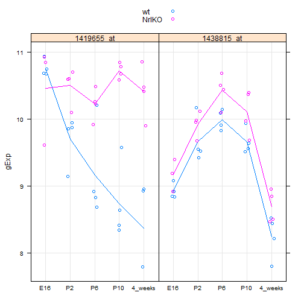 


###############

A function to stripplot a mini-dataset

```r
makeStripplot <- function(df) {
    stripplot(gExp ~ devStage | gene, df, group = gType, jitter.data = TRUE, 
        auto.key = TRUE, type = c("p", "a"), grid = TRUE)
}
```


Test the stripplot function

```r
makeStripplot(jDat)
```

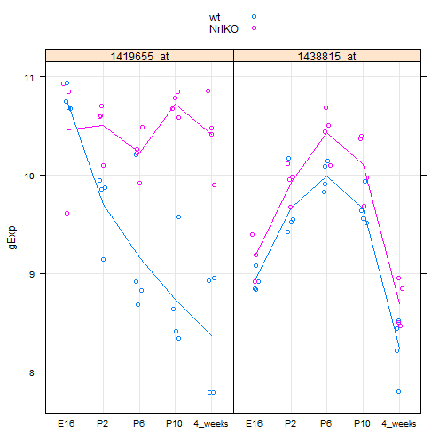 

```r
makeStripplot(newDat <- prepareData("1456341_a_at"))
```

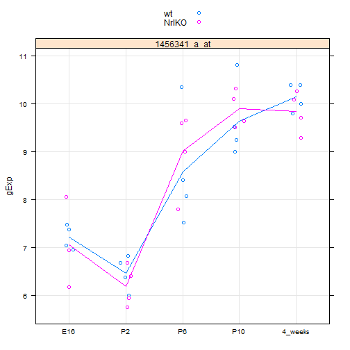 

```r
str(newDat)
```

```
## 'data.frame':	39 obs. of  6 variables:
##  $ sidChar : chr  "Sample_20" "Sample_21" "Sample_22" "Sample_23" ...
##  $ sidNum  : num  20 21 22 23 16 17 6 24 25 26 ...
##  $ devStage: Factor w/ 5 levels "E16","P2","P6",..: 1 1 1 1 1 1 1 2 2 2 ...
##  $ gType   : Factor w/ 2 levels "wt","NrlKO": 1 1 1 1 2 2 2 1 1 1 ...
##  $ gExp    : num  7.04 7.48 7.37 6.94 6.16 ...
##  $ gene    : Factor w/ 1 level "1456341_a_at": 1 1 1 1 1 1 1 1 1 1 ...
```

```r
head(newDat)
```

```
##      sidChar sidNum devStage gType  gExp         gene
## 12 Sample_20     20      E16    wt 7.044 1456341_a_at
## 13 Sample_21     21      E16    wt 7.478 1456341_a_at
## 14 Sample_22     22      E16    wt 7.374 1456341_a_at
## 15 Sample_23     23      E16    wt 6.944 1456341_a_at
## 9  Sample_16     16      E16 NrlKO 6.161 1456341_a_at
## 10 Sample_17     17      E16 NrlKO 6.931 1456341_a_at
```


###############

Test for a difference in expected gene expression for probeset "1456341_a_at" at developmental stage P2 vs. 4 weeks post-natal (ignoring genotype, i.e. lump the wild types and knockouts together).


Assume a common variance in the two groups.

```r
ttInput <- subset(prepareData("1456341_a_at"), devStage %in% c("P2", "4_weeks"))
t.test(gExp ~ devStage, ttInput)
```

```
## 
## 	Welch Two Sample t-test
## 
## data:  gExp by devStage 
## t = -18.84, df = 13.98, p-value = 2.477e-11
## alternative hypothesis: true difference in means is not equal to 0 
## 95 percent confidence interval:
##  -4.078 -3.244 
## sample estimates:
##      mean in group P2 mean in group 4_weeks 
##                 6.326                 9.987
```


###############

Fit a linear model with a categorical covariate = do "one-way ANOVA". Focus on probeset "1438786_a_at".

```r
makeStripplot(mDat <- prepareData("1438786_a_at"))
```

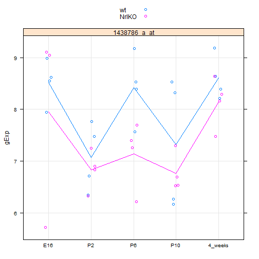 


Let's focus just on the wild type data for now. 
Model expression as a function of the devStage factor.

```r
mFit <- lm(formula = gExp ~ devStage, data = mDat, subset = gType == "wt")
summary(mFit)
```

```
## 
## Call:
## lm(formula = gExp ~ devStage, data = mDat, subset = gType == 
##     "wt")
## 
## Residuals:
##     Min      1Q  Median      3Q     Max 
## -1.1565 -0.4400  0.0288  0.4915  1.2065 
## 
## Coefficients:
##                 Estimate Std. Error t value Pr(>|t|)    
## (Intercept)        8.523      0.379   22.50  5.7e-13 ***
## devStageP2        -1.450      0.536   -2.71    0.016 *  
## devStageP6        -0.107      0.536   -0.20    0.845    
## devStageP10       -1.201      0.536   -2.24    0.040 *  
## devStage4_weeks    0.081      0.536    0.15    0.882    
## ---
## Signif. codes:  0 '***' 0.001 '**' 0.01 '*' 0.05 '.' 0.1 ' ' 1 
## 
## Residual standard error: 0.758 on 15 degrees of freedom
## Multiple R-squared: 0.497,	Adjusted R-squared: 0.363 
## F-statistic: 3.71 on 4 and 15 DF,  p-value: 0.0272
```


Vet your inferential results: does the intercept look plausible given the plot? How about the devStageP2 effect, etc.?
_Yes, looks right._

###############

Test whether the P2 and P10 effects are equal or, equivalently, whether their difference is equal to zero.
Construct the contrast matrix to form the difference between the P2 and P10 effects.

```r
contMat = matrix(c(0, 1, 0, -1, 0), nrow = 1)
(obsDiff <- contMat %*% coef(mFit))
```

```
##        [,1]
## [1,] -0.249
```


Check that this really is the observed difference in sample mean for the wild type mice, P2 vs. P10.

```r
(sampMeans <- aggregate(gExp ~ devStage, mDat, FUN = mean, subset = gType == 
    "wt"))
```

```
##   devStage  gExp
## 1      E16 8.523
## 2       P2 7.072
## 3       P6 8.416
## 4      P10 7.322
## 5  4_weeks 8.604
```

```r
with(sampMeans, gExp[devStage == "P2"] - gExp[devStage == "P10"])
```

```
## [1] -0.249
```


Calculate the (estimated) standard error for our contrast. The variance-covariance matrix can be obtained with vcov():

```r
vcov(mFit)
```

```
##                 (Intercept) devStageP2 devStageP6 devStageP10
## (Intercept)          0.1435    -0.1435    -0.1435     -0.1435
## devStageP2          -0.1435     0.2870     0.1435      0.1435
## devStageP6          -0.1435     0.1435     0.2870      0.1435
## devStageP10         -0.1435     0.1435     0.1435      0.2870
## devStage4_weeks     -0.1435     0.1435     0.1435      0.1435
##                 devStage4_weeks
## (Intercept)             -0.1435
## devStageP2               0.1435
## devStageP6               0.1435
## devStageP10              0.1435
## devStage4_weeks          0.2870
```


Let's check that this is really true. If we take the diagonal elements and take their square root, 
They should be exactly equal to the standard errors reported for out original model.

```r
summary(mFit)$coefficients[, "Std. Error"]
```

```
##     (Intercept)      devStageP2      devStageP6     devStageP10 
##          0.3788          0.5357          0.5357          0.5357 
## devStage4_weeks 
##          0.5357
```

```r
sqrt(diag(vcov(mFit)))
```

```
##     (Intercept)      devStageP2      devStageP6     devStageP10 
##          0.3788          0.5357          0.5357          0.5357 
## devStage4_weeks 
##          0.5357
```


A typical matrix of inferential results 

```r
summary(mFit)$coefficients
```

```
##                 Estimate Std. Error t value  Pr(>|t|)
## (Intercept)       8.5227     0.3788 22.4979 5.697e-13
## devStageP2       -1.4503     0.5357 -2.7070 1.623e-02
## devStageP6       -0.1067     0.5357 -0.1993 8.447e-01
## devStageP10      -1.2012     0.5357 -2.2422 4.049e-02
## devStage4_weeks   0.0810     0.5357  0.1512 8.818e-01
```


Variance-covariance matrix of a contrast 

```r
(estSe <- contMat %*% vcov(mFit) %*% t(contMat))
```

```
##       [,1]
## [1,] 0.287
```


Form a test statistic as an observed effect divided by its estimated standard error:

```r
(testStat <- obsDiff/estSe)
```

```
##         [,1]
## [1,] -0.8676
```


Compute a two-sided p-value 

```r
2 * pt(abs(testStat), df = df.residual(mFit), lower.tail = FALSE)
```

```
##        [,1]
## [1,] 0.3993
```


Not surprisingly, this p-value is rather large and we conclude there is no difference.

##################
Fit a linear model with two categorical covariates

Focus on probeset "1448690_at"

```r
makeStripplot(oDat <- prepareData("1448690_at"))
```

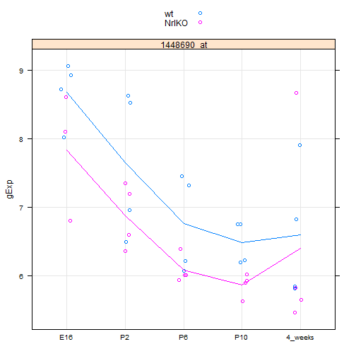 

```r
str(oDat)
```

```
## 'data.frame':	39 obs. of  6 variables:
##  $ sidChar : chr  "Sample_20" "Sample_21" "Sample_22" "Sample_23" ...
##  $ sidNum  : num  20 21 22 23 16 17 6 24 25 26 ...
##  $ devStage: Factor w/ 5 levels "E16","P2","P6",..: 1 1 1 1 1 1 1 2 2 2 ...
##  $ gType   : Factor w/ 2 levels "wt","NrlKO": 1 1 1 1 2 2 2 1 1 1 ...
##  $ gExp    : num  8.02 9.05 8.71 8.92 6.8 ...
##  $ gene    : Factor w/ 1 level "1448690_at": 1 1 1 1 1 1 1 1 1 1 ...
```


Fit a linear model with covariates gType and devStage and include their interactions.

```r
oFitBig <- lm(formula = gExp ~ gType * devStage, data = oDat)
summary(oFitBig)$coef
```

```
##                            Estimate Std. Error  t value  Pr(>|t|)
## (Intercept)                 8.67800     0.3987 21.76755 1.634e-19
## gTypeNrlKO                 -0.84233     0.6090 -1.38320 1.772e-01
## devStageP2                 -1.02900     0.5638 -1.82512 7.830e-02
## devStageP6                 -1.91450     0.5638 -3.39571 2.003e-03
## devStageP10                -2.19325     0.5638 -3.89012 5.387e-04
## devStage4_weeks            -2.08200     0.5638 -3.69280 9.149e-04
## gTypeNrlKO:devStageP2       0.06983     0.8299  0.08415 9.335e-01
## gTypeNrlKO:devStageP6       0.16533     0.8299  0.19922 8.435e-01
## gTypeNrlKO:devStageP10      0.22583     0.8299  0.27212 7.875e-01
## gTypeNrlKO:devStage4_weeks  0.64608     0.8299  0.77852 4.426e-01
```

Vet the results. Is the intercept plausible? How about the various effects? Do the ones with small p-values, e.g. meeting a conventional cut-off of 0.05, look 'real' to you?
_Intercept and effects seem reasonable_

Fit a related, smaller model with the same covariates, but this time omit the interaction.

```r
oFitSmall <- lm(formula = gExp ~ gType + devStage, data = oDat)
```


Let's determine if the interaction terms are truly necessary. Recall the anova() function can take two fitted models, 
one nested within the other, and perform this test.
```{R}
anova(oFitSmall, oFitBig)
```

With a p-value very close to one, we confirm that there is no evidence for interaction in this particular case.

Looking at a more interesting gene

```r
makeStripplot(oDat2 <- prepareData("1429225_at"))
```

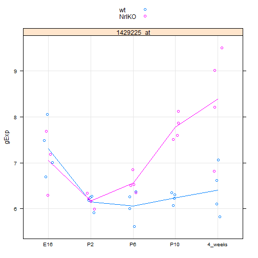 

```r
oFitBig2 <- lm(formula = gExp ~ gType * devStage, data = oDat2)
oFitSmall2 <- lm(formula = gExp ~ gType + devStage, data = oDat2)
anova(oFitSmall2, oFitBig2)
```

```
## Analysis of Variance Table
## 
## Model 1: gExp ~ gType + devStage
## Model 2: gExp ~ gType * devStage
##   Res.Df   RSS Df Sum of Sq    F Pr(>F)    
## 1     33 15.12                             
## 2     29  7.95  4      7.17 6.54  7e-04 ***
## ---
## Signif. codes:  0 '***' 0.001 '**' 0.01 '*' 0.05 '.' 0.1 ' ' 1
```


The interaction here is highly statistically significant.

################
Further work
use data aggregation strategies from last week to do some of the same work for small sets of genes

```r
genes = c("1419655_at", "1438815_at")
jDat <- prepareData(genes)
library(plyr)
```

```
## Warning: package 'plyr' was built under R version 2.15.3
```

```r
(aggr <- ddply(jDat, ~sidChar + devStage + gType, summarize, gExp = mean(gExp), 
    gene = paste(genes, collapse = " & ")))
```

```
##      sidChar devStage gType   gExp                    gene
## 1   Sample_1       P6 NrlKO 10.450 1419655_at & 1438815_at
## 2  Sample_10       P6 NrlKO 10.490 1419655_at & 1438815_at
## 3  Sample_11  4_weeks NrlKO  9.468 1419655_at & 1438815_at
## 4  Sample_12  4_weeks NrlKO  9.369 1419655_at & 1438815_at
## 5  Sample_13      P10 NrlKO 10.615 1419655_at & 1438815_at
## 6  Sample_14       P2 NrlKO 10.340 1419655_at & 1438815_at
## 7  Sample_15      P10 NrlKO 10.319 1419655_at & 1438815_at
## 8  Sample_16      E16 NrlKO  9.261 1419655_at & 1438815_at
## 9  Sample_17      E16 NrlKO 10.116 1419655_at & 1438815_at
## 10 Sample_18      P10 NrlKO 10.575 1419655_at & 1438815_at
## 11 Sample_19      P10 NrlKO 10.130 1419655_at & 1438815_at
## 12  Sample_2  4_weeks NrlKO  9.458 1419655_at & 1438815_at
## 13 Sample_20      E16    wt  9.884 1419655_at & 1438815_at
## 14 Sample_21      E16    wt  9.794 1419655_at & 1438815_at
## 15 Sample_22      E16    wt  9.875 1419655_at & 1438815_at
## 16 Sample_23      E16    wt  9.799 1419655_at & 1438815_at
## 17 Sample_24       P2    wt  9.732 1419655_at & 1438815_at
## 18 Sample_25       P2    wt  9.698 1419655_at & 1438815_at
## 19 Sample_26       P2    wt 10.018 1419655_at & 1438815_at
## 20 Sample_27       P2    wt  9.283 1419655_at & 1438815_at
## 21 Sample_28       P6    wt  9.296 1419655_at & 1438815_at
## 22 Sample_29       P6    wt 10.170 1419655_at & 1438815_at
## 23  Sample_3       P2 NrlKO 10.355 1419655_at & 1438815_at
## 24 Sample_30       P6    wt  9.459 1419655_at & 1438815_at
## 25 Sample_31       P6    wt  9.372 1419655_at & 1438815_at
## 26 Sample_32      P10    wt  9.605 1419655_at & 1438815_at
## 27 Sample_33      P10    wt  8.945 1419655_at & 1438815_at
## 28 Sample_34      P10    wt  9.073 1419655_at & 1438815_at
## 29 Sample_35      P10    wt  9.170 1419655_at & 1438815_at
## 30 Sample_36  4_weeks    wt  8.374 1419655_at & 1438815_at
## 31 Sample_37  4_weeks    wt  8.156 1419655_at & 1438815_at
## 32 Sample_38  4_weeks    wt  8.567 1419655_at & 1438815_at
## 33 Sample_39  4_weeks    wt  8.114 1419655_at & 1438815_at
## 34  Sample_4       P6 NrlKO 10.350 1419655_at & 1438815_at
## 35  Sample_5       P2 NrlKO 10.026 1419655_at & 1438815_at
## 36  Sample_6      E16 NrlKO 10.056 1419655_at & 1438815_at
## 37  Sample_7       P6 NrlKO 10.007 1419655_at & 1438815_at
## 38  Sample_8       P2 NrlKO 10.131 1419655_at & 1438815_at
## 39  Sample_9  4_weeks NrlKO  9.901 1419655_at & 1438815_at
```

```r
makeStripplot(aggr)
```

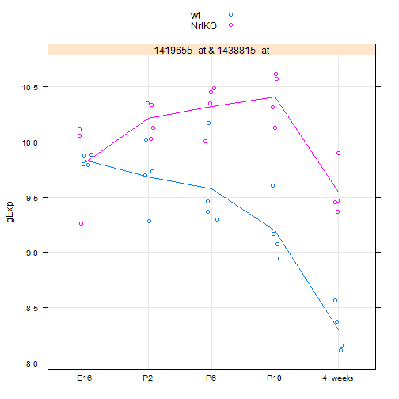 


Fit linear and quadratic models to the expression data for one or several genes

```r
library(car)
```

```
## Warning: package 'car' was built under R version 2.15.3
```

```r
mDat <- prepareData("1438786_a_at")
mDat$age <- recode(mDat$devStage, "'E16'=-2; 'P2'=2; 'P6'=6; 'P10'=10; '4_weeks'=28", 
    as.factor.result = FALSE)
head(mDat)
```

```
##      sidChar sidNum devStage gType  gExp         gene age
## 12 Sample_20     20      E16    wt 7.938 1438786_a_at  -2
## 13 Sample_21     21      E16    wt 8.986 1438786_a_at  -2
## 14 Sample_22     22      E16    wt 8.550 1438786_a_at  -2
## 15 Sample_23     23      E16    wt 8.617 1438786_a_at  -2
## 9  Sample_16     16      E16 NrlKO 5.721 1438786_a_at  -2
## 10 Sample_17     17      E16 NrlKO 9.104 1438786_a_at  -2
```

```r
library(lattice)
```


Linear fit

```r
linFit = lm(formula = gExp ~ age, data = mDat)
summary(linFit)
```

```
## 
## Call:
## lm(formula = gExp ~ age, data = mDat)
## 
## Residuals:
##     Min      1Q  Median      3Q     Max 
## -1.7046 -0.7445  0.0724  0.7107  1.6784 
## 
## Coefficients:
##             Estimate Std. Error t value Pr(>|t|)    
## (Intercept)   7.4696     0.2091   35.72   <2e-16 ***
## age           0.0220     0.0152    1.45     0.16    
## ---
## Signif. codes:  0 '***' 0.001 '**' 0.01 '*' 0.05 '.' 0.1 ' ' 1 
## 
## Residual standard error: 0.983 on 37 degrees of freedom
## Multiple R-squared: 0.0537,	Adjusted R-squared: 0.0281 
## F-statistic:  2.1 on 1 and 37 DF,  p-value: 0.156
```


Draw points and a LOESS fitted regression curve. Other possible types: "p", "l", "h", "b", "o", "s", "S", "r", "a", "g", "smooth", "spline"
Docs: https://stat.ethz.ch/R-manual/R-devel/library/lattice/html/panel.xyplot.html

```r
xyplot(gExp ~ age, mDat, type = c("smooth", "p"))
```

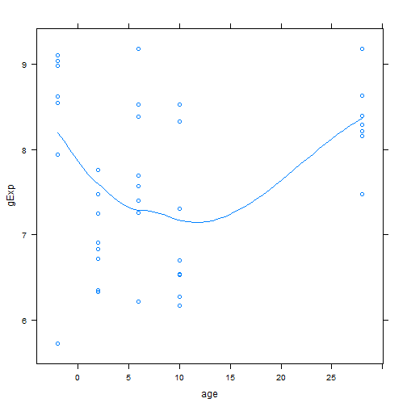 


Quadratic fit

```r
quadFit = lm(formula = gExp ~ age + I(age^2), data = mDat)
summary(quadFit)
```

```
## 
## Call:
## lm(formula = gExp ~ age + I(age^2), data = mDat)
## 
## Residuals:
##     Min      1Q  Median      3Q     Max 
## -2.2865 -0.6455 -0.0257  0.5760  1.8923 
## 
## Coefficients:
##             Estimate Std. Error t value Pr(>|t|)    
## (Intercept)  7.77041    0.22128   35.12   <2e-16 ***
## age         -0.10917    0.04950   -2.21    0.034 *  
## I(age^2)     0.00468    0.00169    2.76    0.009 ** 
## ---
## Signif. codes:  0 '***' 0.001 '**' 0.01 '*' 0.05 '.' 0.1 ' ' 1 
## 
## Residual standard error: 0.906 on 36 degrees of freedom
## Multiple R-squared: 0.219,	Adjusted R-squared: 0.176 
## F-statistic: 5.05 on 2 and 36 DF,  p-value: 0.0117
```

```r
xyplot(gExp ~ age^2, mDat, type = c("smooth", "p"))
```

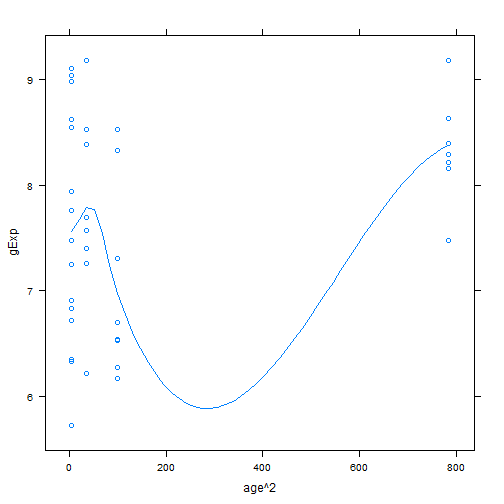 


4 week developmental stage generally posed a difficult fitting problem for the quadratic model where we regressed expression on age. Шt is simply too far separated in time to be easily modelled quantitatively with the other 4 developmental stages.


Let's drop the 4 week data and revisit this dataset with linear and quadratic models.

```r
(mDatSubset <- subset(mDat, devStage != "4_weeks"))
```

```
##      sidChar sidNum devStage gType  gExp         gene age
## 12 Sample_20     20      E16    wt 7.938 1438786_a_at  -2
## 13 Sample_21     21      E16    wt 8.986 1438786_a_at  -2
## 14 Sample_22     22      E16    wt 8.550 1438786_a_at  -2
## 15 Sample_23     23      E16    wt 8.617 1438786_a_at  -2
## 9  Sample_16     16      E16 NrlKO 5.721 1438786_a_at  -2
## 10 Sample_17     17      E16 NrlKO 9.104 1438786_a_at  -2
## 11  Sample_6      6      E16 NrlKO 9.042 1438786_a_at  -2
## 28 Sample_24     24       P2    wt 6.712 1438786_a_at   2
## 29 Sample_25     25       P2    wt 7.760 1438786_a_at   2
## 30 Sample_26     26       P2    wt 6.343 1438786_a_at   2
## 31 Sample_27     27       P2    wt 7.475 1438786_a_at   2
## 24 Sample_14     14       P2 NrlKO 7.248 1438786_a_at   2
## 25  Sample_3      3       P2 NrlKO 6.902 1438786_a_at   2
## 26  Sample_5      5       P2 NrlKO 6.826 1438786_a_at   2
## 27  Sample_8      8       P2 NrlKO 6.329 1438786_a_at   2
## 36 Sample_28     28       P6    wt 7.569 1438786_a_at   6
## 37 Sample_29     29       P6    wt 8.388 1438786_a_at   6
## 38 Sample_30     30       P6    wt 9.176 1438786_a_at   6
## 39 Sample_31     31       P6    wt 8.531 1438786_a_at   6
## 32  Sample_1      1       P6 NrlKO 7.258 1438786_a_at   6
## 33 Sample_10     10       P6 NrlKO 7.692 1438786_a_at   6
## 34  Sample_4      4       P6 NrlKO 7.398 1438786_a_at   6
## 35  Sample_7      7       P6 NrlKO 6.211 1438786_a_at   6
## 20 Sample_32     32      P10    wt 8.528 1438786_a_at  10
## 21 Sample_33     33      P10    wt 6.269 1438786_a_at  10
## 22 Sample_34     34      P10    wt 6.165 1438786_a_at  10
## 23 Sample_35     35      P10    wt 8.324 1438786_a_at  10
## 16 Sample_13     13      P10 NrlKO 6.537 1438786_a_at  10
## 17 Sample_15     15      P10 NrlKO 6.696 1438786_a_at  10
## 18 Sample_18     18      P10 NrlKO 7.299 1438786_a_at  10
## 19 Sample_19     19      P10 NrlKO 6.524 1438786_a_at  10
```

```r
mDatSubset$age <- recode(mDatSubset$devStage, "'E16'=-2; 'P2'=2; 'P6'=6; 'P10'=10", 
    as.factor.result = FALSE)
linFit = lm(formula = gExp ~ age, data = mDat)
summary(linFit)
```

```
## 
## Call:
## lm(formula = gExp ~ age, data = mDat)
## 
## Residuals:
##     Min      1Q  Median      3Q     Max 
## -1.7046 -0.7445  0.0724  0.7107  1.6784 
## 
## Coefficients:
##             Estimate Std. Error t value Pr(>|t|)    
## (Intercept)   7.4696     0.2091   35.72   <2e-16 ***
## age           0.0220     0.0152    1.45     0.16    
## ---
## Signif. codes:  0 '***' 0.001 '**' 0.01 '*' 0.05 '.' 0.1 ' ' 1 
## 
## Residual standard error: 0.983 on 37 degrees of freedom
## Multiple R-squared: 0.0537,	Adjusted R-squared: 0.0281 
## F-statistic:  2.1 on 1 and 37 DF,  p-value: 0.156
```

```r
xyplot(gExp ~ age, mDatSubset, type = c("smooth", "p"))
```

```
## Warning: pseudoinverse used at 2
## Warning: neighborhood radius 4
## Warning: reciprocal condition number  0
## Warning: There are other near singularities as well. 16
## Warning: pseudoinverse used at 2
## Warning: neighborhood radius 4
## Warning: reciprocal condition number  0
## Warning: There are other near singularities as well. 16
## Warning: pseudoinverse used at 2
## Warning: neighborhood radius 4
## Warning: reciprocal condition number  0
## Warning: There are other near singularities as well. 16
## Warning: pseudoinverse used at 2
## Warning: neighborhood radius 4
## Warning: reciprocal condition number  0
## Warning: There are other near singularities as well. 16
## Warning: pseudoinverse used at 2
## Warning: neighborhood radius 4
## Warning: reciprocal condition number  0
## Warning: There are other near singularities as well. 16
```

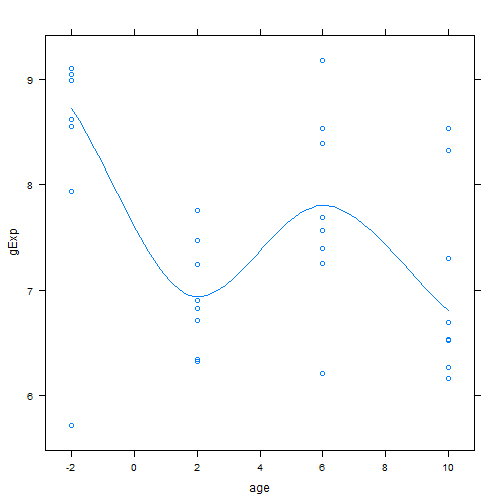 


```r
quadFit = lm(formula = gExp ~ age + I(age^2), data = mDat)
summary(quadFit)
```

```
## 
## Call:
## lm(formula = gExp ~ age + I(age^2), data = mDat)
## 
## Residuals:
##     Min      1Q  Median      3Q     Max 
## -2.2865 -0.6455 -0.0257  0.5760  1.8923 
## 
## Coefficients:
##             Estimate Std. Error t value Pr(>|t|)    
## (Intercept)  7.77041    0.22128   35.12   <2e-16 ***
## age         -0.10917    0.04950   -2.21    0.034 *  
## I(age^2)     0.00468    0.00169    2.76    0.009 ** 
## ---
## Signif. codes:  0 '***' 0.001 '**' 0.01 '*' 0.05 '.' 0.1 ' ' 1 
## 
## Residual standard error: 0.906 on 36 degrees of freedom
## Multiple R-squared: 0.219,	Adjusted R-squared: 0.176 
## F-statistic: 5.05 on 2 and 36 DF,  p-value: 0.0117
```

```r
xyplot(gExp ~ age^2, mDatSubset, type = c("smooth", "p"))
```

```
## Warning: pseudoinverse used at 3.52
## Warning: neighborhood radius 32.48
## Warning: reciprocal condition number  0
## Warning: There are other near singularities as well. 1024
## Warning: pseudoinverse used at 3.52
## Warning: neighborhood radius 32.48
## Warning: reciprocal condition number  0
## Warning: There are other near singularities as well. 1024
## Warning: pseudoinverse used at 3.52
## Warning: neighborhood radius 32.48
## Warning: reciprocal condition number  0
## Warning: There are other near singularities as well. 1024
## Warning: pseudoinverse used at 3.52
## Warning: neighborhood radius 32.48
## Warning: reciprocal condition number  0
## Warning: There are other near singularities as well. 1024
## Warning: pseudoinverse used at 3.52
## Warning: neighborhood radius 32.48
## Warning: reciprocal condition number  0
## Warning: There are other near singularities as well. 1024
```

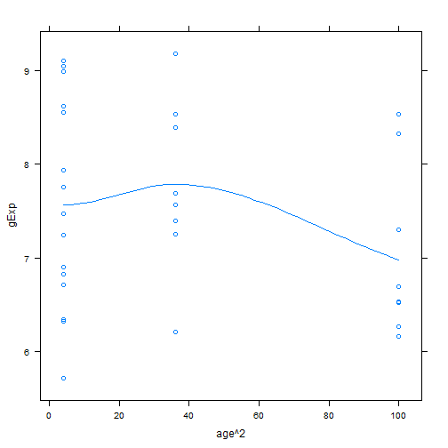 


