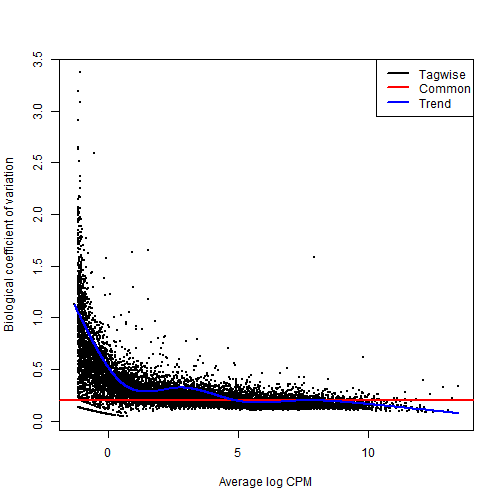
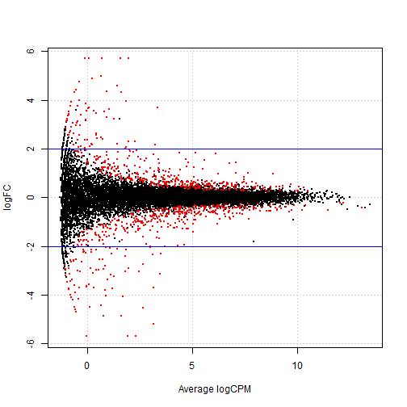
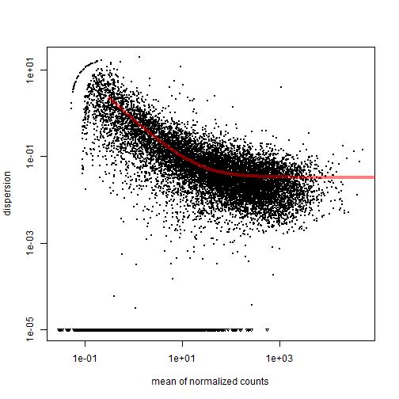
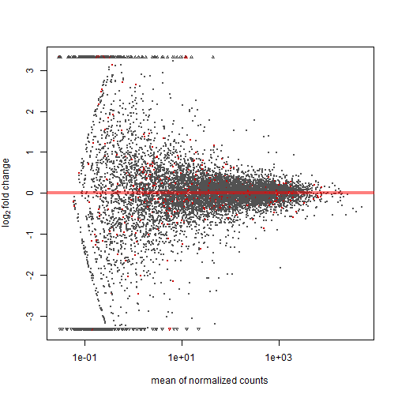
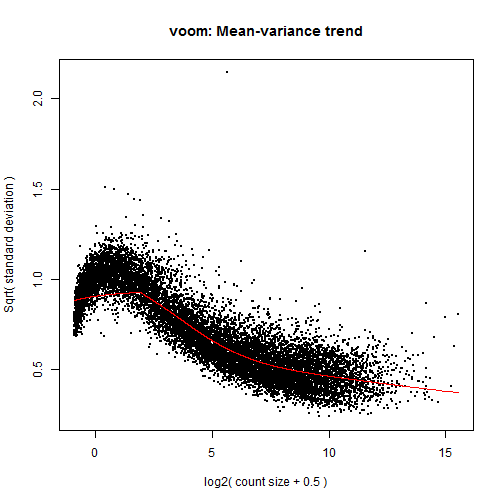
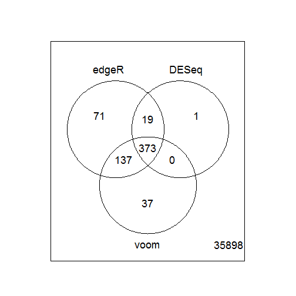

Seminar 07
========================================================

Load data

```r
setwd("C:/Users/Kateryna/Documents/RStudio")
dat <- read.table("bottomly_count_table.tsv", header = TRUE, row.names = 1)
des <- read.table("bottomly_phenodata.tsv", header = TRUE, row.names = 1)
```


```r
library(edgeR)
```

```
## Loading required package: limma
```


Create a 'group' object describing which group each sample belongs to:

```r
group <- factor(c(rep("1", 10), rep("2", 11)))
```


This produces an object of type DGEList with can be manipulated in a similar way to any other list object in R

```r
dge.glm <- DGEList(counts = dat, group = group)
nrow(dge.glm[[1]])
```

```
## [1] 36536
```

```r
ncol(dge.glm[[1]])
```

```
## [1] 21
```

```r

design <- model.matrix(~group)
dge.glm.com.disp <- estimateGLMCommonDisp(dge.glm, design, verbose = TRUE)
```

```
## Disp = 0.03893 , BCV = 0.1973
```

```r
dge.glm.trend.disp <- estimateGLMTrendedDisp(dge.glm.com.disp)
```

```
## Loading required package: splines
```

```r
dge.glm.tag.disp <- estimateGLMTagwiseDisp(dge.glm.trend.disp, design)
```


Plot the tagwise dispersion against log2-CPM (counts per million)

```r
plotBCV(dge.glm.tag.disp)
```

 

```r

fit <- glmFit(dge.glm.tag.disp, design)

lrt <- glmLRT(fit, coef = 2)

tt.glm <- topTags(lrt, n = Inf)

interestingSamples <- rownames(tt.glm$table[tt.glm$table$FDR < 1e-50, ])
cpm(dge.glm.tag.disp)[interestingSamples, ]
```

```
##                    SRX033480 SRX033488 SRX033481 SRX033489 SRX033482
## ENSMUSG00000020912     20.39    12.691     15.83    14.819    19.230
## ENSMUSG00000050141     14.14    10.153     10.67     6.264     9.946
## ENSMUSG00000035775     14.47    10.629     19.51    11.305    12.930
## ENSMUSG00000015484     26.97    33.949     32.76    36.206    31.497
## ENSMUSG00000024248     14.80    26.017     17.30    23.527    18.567
## ENSMUSG00000030532     27.96    24.906     21.35    25.360    18.567
## ENSMUSG00000054354     10.85     7.615     11.41     8.708     8.289
## ENSMUSG00000023236     65.45    78.684     72.50    72.413    76.587
##                    SRX033490 SRX033483 SRX033476 SRX033478 SRX033479
## ENSMUSG00000020912    17.330    26.430    13.359    23.621    14.310
## ENSMUSG00000050141     7.890     8.361     6.583    11.911    12.402
## ENSMUSG00000035775    12.540    12.136     6.389    13.527    11.210
## ENSMUSG00000015484    33.393    30.745    34.655    26.851    31.482
## ENSMUSG00000024248    25.784    18.879    24.781    14.334    14.310
## ENSMUSG00000030532    26.770    26.430    19.167    23.217    20.034
## ENSMUSG00000054354     7.608     7.012     3.291     4.442     5.963
## ENSMUSG00000023236    80.875    83.336    55.178    57.740    66.303
##                    SRX033472 SRX033473 SRX033474 SRX033475 SRX033491
## ENSMUSG00000020912    0.5037    0.4226    1.0805    0.2802    1.0995
## ENSMUSG00000050141    0.2518    0.0000    0.0000    0.2802    0.8246
## ENSMUSG00000035775    0.7555    0.0000    0.2701    0.2802    0.6872
## ENSMUSG00000015484    7.0516    4.8595    9.1841    7.8443    8.5209
## ENSMUSG00000024248    2.2666    1.2677    1.8908    3.3618    3.1610
## ENSMUSG00000030532   69.7605   70.5683   63.2082   63.0343   73.8023
## ENSMUSG00000054354    0.0000    0.0000    0.0000    0.0000    0.5497
## ENSMUSG00000023236  195.4301  183.6044  176.1186  156.3252  206.9762
##                    SRX033484 SRX033492 SRX033485 SRX033493 SRX033486
## ENSMUSG00000020912    0.0000    0.7027    0.8651    0.1362    0.0000
## ENSMUSG00000050141    0.0000    0.1405    0.0000    0.1362    0.2578
## ENSMUSG00000035775    0.6784    0.1405    0.5767    0.1362    1.8045
## ENSMUSG00000015484    9.4974    8.4319    8.9396    6.6759   10.3116
## ENSMUSG00000024248    1.5829    1.6864    1.7302    1.7712    2.5779
## ENSMUSG00000030532   70.0997   70.6873   62.5770   78.6123   59.2919
## ENSMUSG00000054354    0.0000    0.0000    0.0000    0.0000    0.0000
## ENSMUSG00000023236  177.9628  192.8090  207.0519  201.6399  204.6859
##                    SRX033494
## ENSMUSG00000020912    0.0000
## ENSMUSG00000050141    0.1477
## ENSMUSG00000035775    0.5907
## ENSMUSG00000015484    8.8604
## ENSMUSG00000024248    3.1012
## ENSMUSG00000030532   71.3265
## ENSMUSG00000054354    0.0000
## ENSMUSG00000023236  192.7144
```

```r

summary(de.glm <- decideTestsDGE(lrt, p = 0.05, adjust = "BH"))
```

```
##    [,1] 
## -1   451
## 0  35660
## 1    425
```


Plotting the tagwise log fold changes against log-cpm

```r
tags.glm <- rownames(dge.glm.tag.disp)[as.logical(de.glm)]
plotSmear(lrt, de.tags = tags.glm)
abline(h = c(-2, 2), col = "blue")
```

 


Exercises
Filter the data and remove any gene that has count equal to zero across all samples 

```r
dge.glm.clean1 <- DGEList(counts = dat, group = group, remove.zeros = T)
```

```
## Removing 22604 rows with all zero counts.
```

```r
str(dge.glm.clean1)
```

```
## Formal class 'DGEList' [package "edgeR"] with 1 slots
##   ..@ .Data:List of 2
##   .. ..$ : int [1:13932, 1:21] 369 0 0 0 21 15 517 273 11 1 ...
##   .. .. ..- attr(*, "dimnames")=List of 2
##   .. .. .. ..$ : chr [1:13932] "ENSMUSG00000000001" "ENSMUSG00000000028" "ENSMUSG00000000037" "ENSMUSG00000000049" ...
##   .. .. .. ..$ : chr [1:21] "SRX033480" "SRX033488" "SRX033481" "SRX033489" ...
##   .. ..$ :'data.frame':	21 obs. of  3 variables:
##   .. .. ..$ group       : Factor w/ 2 levels "1","2": 1 1 1 1 1 1 1 1 1 1 ...
##   .. .. ..$ lib.size    : num [1:21] 3040296 6303665 2717092 6545795 3016179 ...
##   .. .. ..$ norm.factors: num [1:21] 1 1 1 1 1 1 1 1 1 1 ...
```


Filter the data and remove any gene that has count equal to zero in at least one sample in each genotype group

```r
dge.glm.clean2.toremove <- apply(dge.glm, 1, function(x) {
    return(any(x[1:10] == 0) & any(x[11:21] == 0))
})
dge.glm.clean2.indices <- which(dge.glm.clean2.toremove != T)
dge.glm.clean2 <- dge.glm[dge.glm.clean2.indices, ]
str(dge.glm.clean2)
```

```
## Formal class 'DGEList' [package "edgeR"] with 1 slots
##   ..@ .Data:List of 2
##   .. ..$ : int [1:9973, 1:21] 369 0 21 15 517 273 11 19 19 97 ...
##   .. .. ..- attr(*, "dimnames")=List of 2
##   .. .. .. ..$ : chr [1:9973] "ENSMUSG00000000001" "ENSMUSG00000000028" "ENSMUSG00000000056" "ENSMUSG00000000058" ...
##   .. .. .. ..$ : chr [1:21] "SRX033480" "SRX033488" "SRX033481" "SRX033489" ...
##   .. ..$ :'data.frame':	21 obs. of  3 variables:
##   .. .. ..$ group       : Factor w/ 2 levels "1","2": 1 1 1 1 1 1 1 1 1 1 ...
##   .. .. ..$ lib.size    : num [1:21] 3040296 6303665 2717092 6545795 3016179 ...
##   .. .. ..$ norm.factors: num [1:21] 1 1 1 1 1 1 1 1 1 1 ...
```


DESeq
the differential expression analysis of the same dataset using DESeq.

```r
library(DESeq)
```

```
## Loading required package: BiocGenerics
## Loading required package: parallel
## 
## Attaching package: 'BiocGenerics'
## 
## The following objects are masked from 'package:parallel':
## 
##     clusterApply, clusterApplyLB, clusterCall, clusterEvalQ,
##     clusterExport, clusterMap, parApply, parCapply, parLapply,
##     parLapplyLB, parRapply, parSapply, parSapplyLB
## 
## The following object is masked from 'package:limma':
## 
##     plotMA
## 
## The following object is masked from 'package:stats':
## 
##     xtabs
## 
## The following objects are masked from 'package:base':
## 
##     anyDuplicated, append, as.data.frame, as.vector, cbind,
##     colnames, do.call, duplicated, eval, evalq, Filter, Find, get,
##     intersect, is.unsorted, lapply, Map, mapply, match, mget,
##     order, paste, pmax, pmax.int, pmin, pmin.int, Position, rank,
##     rbind, Reduce, rep.int, rownames, sapply, setdiff, sort,
##     table, tapply, union, unique, unlist
## 
## Loading required package: Biobase
## Welcome to Bioconductor
## 
##     Vignettes contain introductory material; view with
##     'browseVignettes()'. To cite Bioconductor, see
##     'citation("Biobase")', and for packages 'citation("pkgname")'.
## 
## Loading required package: locfit
## locfit 1.5-9.1 	 2013-03-22
## Loading required package: lattice
##     Welcome to 'DESeq'. For improved performance, usability and
##     functionality, please consider migrating to 'DESeq2'.
```


Reading in the same count table data and grouping information

```r
deSeqDat <- newCountDataSet(dat, group)
head(counts(deSeqDat))
```

```
##                    SRX033480 SRX033488 SRX033481 SRX033489 SRX033482
## ENSMUSG00000000001       369       744       287       769       348
## ENSMUSG00000000003         0         0         0         0         0
## ENSMUSG00000000028         0         1         0         1         1
## ENSMUSG00000000031         0         0         0         0         0
## ENSMUSG00000000037         0         1         1         5         0
## ENSMUSG00000000049         0         1         0         1         0
##                    SRX033490 SRX033483 SRX033476 SRX033478 SRX033479
## ENSMUSG00000000001       803       433       469       585       321
## ENSMUSG00000000003         0         0         0         0         0
## ENSMUSG00000000028         1         0         7         6         1
## ENSMUSG00000000031         0         0         0         0         0
## ENSMUSG00000000037         4         0         0         0         0
## ENSMUSG00000000049         0         0         0         0         0
##                    SRX033472 SRX033473 SRX033474 SRX033475 SRX033491
## ENSMUSG00000000001       301       461       309       374       781
## ENSMUSG00000000003         0         0         0         0         0
## ENSMUSG00000000028         1         1         1         1         1
## ENSMUSG00000000031         0         0         0         0         0
## ENSMUSG00000000037         4         1         1         0         1
## ENSMUSG00000000049         0         0         0         0         0
##                    SRX033484 SRX033492 SRX033485 SRX033493 SRX033486
## ENSMUSG00000000001       555       820       294       758       419
## ENSMUSG00000000003         0         0         0         0         0
## ENSMUSG00000000028         2         1         1         4         1
## ENSMUSG00000000031         0         0         0         0         0
## ENSMUSG00000000037         2         1         1         1         1
## ENSMUSG00000000049         0         0         0         0         0
##                    SRX033494
## ENSMUSG00000000001       857
## ENSMUSG00000000003         0
## ENSMUSG00000000028         5
## ENSMUSG00000000031         0
## ENSMUSG00000000037         2
## ENSMUSG00000000049         0
```


Estimate the size factors to account for differences in library coverage and estimate the variance:

```r
deSeqDat <- estimateSizeFactors(deSeqDat)
sizeFactors(deSeqDat)
```

```
## SRX033480 SRX033488 SRX033481 SRX033489 SRX033482 SRX033490 SRX033483 
##    0.6439    1.3454    0.5785    1.4295    0.6355    1.5240    0.7933 
## SRX033476 SRX033478 SRX033479 SRX033472 SRX033473 SRX033474 SRX033475 
##    1.1272    1.0772    0.8984    0.8886    1.0255    0.7987    0.7796 
## SRX033491 SRX033484 SRX033492 SRX033485 SRX033493 SRX033486 SRX033494 
##    1.6162    0.9882    1.5720    0.7558    1.5922    0.8264    1.4715
```

```r

deSeqDat <- estimateDispersions(deSeqDat)
```


Plotting the estimated dispersions against the mean normalized counts

```r
plotDispEsts(deSeqDat)
```

 


Fit the model and examine the results

```r
results.DESeq <- nbinomTest(deSeqDat, levels(group)[1], levels(group)[2])
str(results.DESeq)
```

```
## 'data.frame':	36536 obs. of  8 variables:
##  $ id            : chr  "ENSMUSG00000000001" "ENSMUSG00000000003" "ENSMUSG00000000028" "ENSMUSG00000000031" ...
##  $ baseMean      : num  489.18 0 1.57 0 1.1 ...
##  $ baseMeanA     : num  509.685 0 1.657 0 0.859 ...
##  $ baseMeanB     : num  470.53 0 1.49 0 1.32 ...
##  $ foldChange    : num  0.923 NaN 0.898 NaN 1.537 ...
##  $ log2FoldChange: num  -0.115 NaN -0.156 NaN 0.62 ...
##  $ pval          : num  0.498 NA 0.829 NA 0.968 ...
##  $ padj          : num  1 NA 1 NA 1 ...
```

```r
plotMA(results.DESeq)
```

 


Voom & limma

```r
library(limma)
norm.factor <- calcNormFactors(dat)
dat.voomed <- voom(dat, design, plot = TRUE, lib.size = colSums(dat) * norm.factor)
```

 

```r
dat.voomed
```

```
## An object of class "EList"
## $E
##                    SRX033480 SRX033488 SRX033481 SRX033489 SRX033482
## ENSMUSG00000000001     6.941     6.916     6.720     6.871     6.860
## ENSMUSG00000000003    -2.588    -3.625    -2.447    -3.716    -2.585
## ENSMUSG00000000028    -2.588    -2.040    -2.447    -2.132    -1.000
## ENSMUSG00000000031    -2.588    -3.625    -2.447    -3.716    -2.585
## ENSMUSG00000000037    -2.588    -2.040    -0.862    -0.257    -2.585
##                    SRX033490 SRX033483 SRX033476 SRX033478 SRX033479
## ENSMUSG00000000001    6.8447      6.87    6.4977    6.8899     6.279
## ENSMUSG00000000003   -3.8055     -2.89   -3.3773   -3.3036    -3.049
## ENSMUSG00000000028   -2.2205     -2.89    0.5296    0.3968    -1.465
## ENSMUSG00000000031   -3.8055     -2.89   -3.3773   -3.3036    -3.049
## ENSMUSG00000000037   -0.6355     -2.89   -3.3773   -3.3036    -3.049
##                    SRX033472 SRX033473 SRX033474 SRX033475 SRX033491
## ENSMUSG00000000001    6.2110     6.615     6.397     6.693     6.737
## ENSMUSG00000000003   -3.0250    -3.236    -2.877    -2.855    -3.873
## ENSMUSG00000000028   -1.4400    -1.651    -1.292    -1.270    -2.288
## ENSMUSG00000000031   -3.0250    -3.236    -2.877    -2.855    -3.873
## ENSMUSG00000000037    0.1449    -1.651    -1.292    -2.855    -2.288
##                    SRX033484 SRX033492 SRX033485 SRX033493 SRX033486
## ENSMUSG00000000001    6.9151     6.855     6.375     6.718     6.760
## ENSMUSG00000000003   -3.2025    -3.825    -2.827    -3.849    -2.952
## ENSMUSG00000000028   -0.8806    -2.240    -1.242    -0.679    -1.367
## ENSMUSG00000000031   -3.2025    -3.825    -2.827    -3.849    -2.952
## ENSMUSG00000000037   -0.8806    -2.240    -1.242    -2.264    -1.367
##                    SRX033494
## ENSMUSG00000000001     7.005
## ENSMUSG00000000003    -3.739
## ENSMUSG00000000028    -0.280
## ENSMUSG00000000031    -3.739
## ENSMUSG00000000037    -1.417
## 36531 more rows ...
## 
## $weights
##        [,1]   [,2]   [,3]   [,4]   [,5]   [,6]   [,7]   [,8]   [,9]  [,10]
## [1,] 15.907 19.293 15.443 19.597 15.899 19.891 16.895 18.482 18.240 17.413
## [2,]  1.632  1.547  1.632  1.531  1.632  1.517  1.632  1.595  1.612  1.632
## [3,]  1.469  1.383  1.488  1.378  1.470  1.374  1.436  1.397  1.402  1.421
## [4,]  1.632  1.547  1.632  1.531  1.632  1.517  1.632  1.595  1.612  1.632
## [5,]  1.558  1.421  1.585  1.414  1.558  1.407  1.507  1.445  1.453  1.484
##       [,11]  [,12]  [,13]  [,14]  [,15]  [,16]  [,17]  [,18]  [,19]  [,20]
## [1,] 16.988 17.670 16.503 16.432 19.760 17.564 19.603 16.339 19.682 16.748
## [2,]  1.632  1.632  1.632  1.632  1.531  1.632  1.539  1.632  1.535  1.632
## [3,]  1.403  1.390  1.415  1.416  1.354  1.392  1.358  1.419  1.356  1.409
## [4,]  1.632  1.632  1.632  1.632  1.531  1.632  1.539  1.632  1.535  1.632
## [5,]  1.423  1.406  1.437  1.439  1.370  1.409  1.373  1.442  1.371  1.429
##       [,21]
## [1,] 19.318
## [2,]  1.555
## [3,]  1.364
## [4,]  1.555
## [5,]  1.377
## 36531 more rows ...
## 
## $design
##   (Intercept) group2
## 1           1      0
## 2           1      0
## 3           1      0
## 4           1      0
## 5           1      0
## 16 more rows ...
## 
## $targets
## [1] 3006197 6166939 2726341 6572633 3000692
## 16 more rows ...
```

```r

fit <- lmFit(dat.voomed, design)
fit <- eBayes(fit)
topTable(fit)
```

```
##                    X.Intercept.    group2 AveExpr      F   P.Value
## ENSMUSG00000025867       12.477 -0.013979  12.471 154234 2.584e-55
## ENSMUSG00000022892       12.268 -0.086479  12.223 138459 1.103e-54
## ENSMUSG00000037852       12.321 -0.237470  12.194 134826 1.576e-54
## ENSMUSG00000042700       10.716 -0.048029  10.692 133973 1.717e-54
## ENSMUSG00000029461       10.300  0.020715  10.311 121795 6.182e-54
## ENSMUSG00000020658        9.610 -0.019628   9.601 119935 7.604e-54
## ENSMUSG00000060261        9.469 -0.015743   9.461 117841 9.635e-54
## ENSMUSG00000032549       11.904  0.003545  11.905 117324 1.022e-53
## ENSMUSG00000024462       10.227 -0.138929  10.153 116767 1.090e-53
## ENSMUSG00000030102       12.085 -0.026149  12.073 112155 1.874e-53
##                    adj.P.Val
## ENSMUSG00000025867 9.442e-51
## ENSMUSG00000022892 1.568e-50
## ENSMUSG00000037852 1.568e-50
## ENSMUSG00000042700 1.568e-50
## ENSMUSG00000029461 4.424e-50
## ENSMUSG00000020658 4.424e-50
## ENSMUSG00000060261 4.424e-50
## ENSMUSG00000032549 4.424e-50
## ENSMUSG00000024462 4.424e-50
## ENSMUSG00000030102 6.417e-50
```


Exercise
Choose a specific threshold for the adjusted p value, find the genes identified 
as differentially expressed using each of edgeR, DESeq and voom+limma. 
Compare the number of genes in these 3 lists, and draw a venn digram demonstrating
the overlap (if any!).


```r
results.edgeR <- tt.glm$table
results.voom <- topTable(fit, coef = 2, adj = "BH", n = Inf)

limit <- 0.01
top.edgeR <- results.edgeR[which(results.edgeR$FDR < limit), ]
top.DESeq <- results.DESeq[which(results.DESeq$padj < limit), ]
top.voom <- results.voom[which(results.voom$adj.P.Val < limit), ]

gnames <- rownames(dat)
```


Filter out indices of top genes

```r
dat.indices.edgeR <- which(gnames %in% rownames(top.edgeR))
dat.indices.DESeq <- which(gnames %in% top.DESeq$id)
dat.indices.voom <- which(gnames %in% rownames(top.voom))
```


Prepare count lists

```r
counts.edgeR <- rep(0, length(gnames))
counts.DESeq <- rep(0, length(gnames))
counts.voom <- rep(0, length(gnames))
```


Fill count lists

```r
counts.edgeR[dat.indices.edgeR] <- 1
counts.DESeq[dat.indices.DESeq] <- 1
counts.voom[dat.indices.voom] <- 1

venn.df <- data.frame(edgeR = counts.edgeR, DESeq = counts.DESeq, voom = counts.voom, 
    row.names = gnames)
venn.counts <- vennCounts(venn.df)
vennDiagram(venn.counts)
```

 

